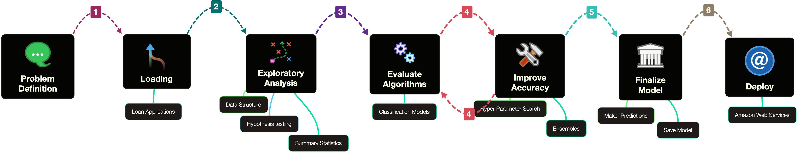
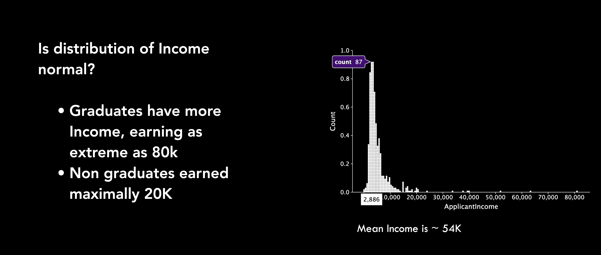
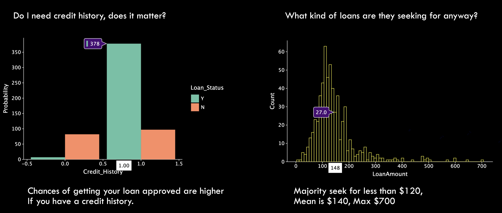
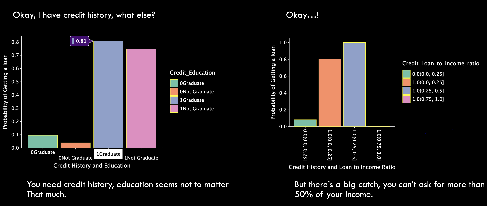
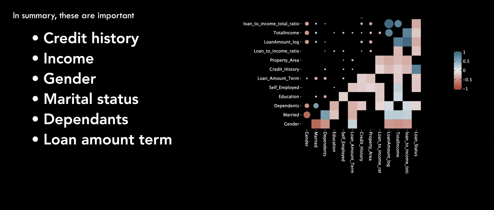
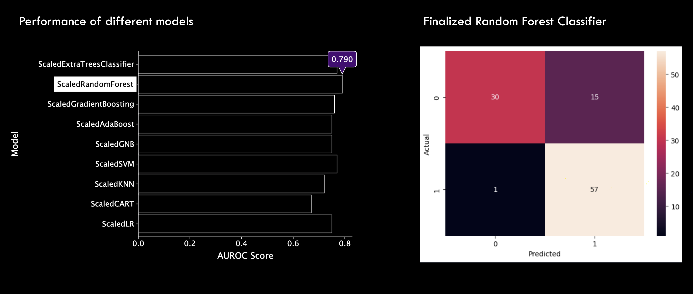
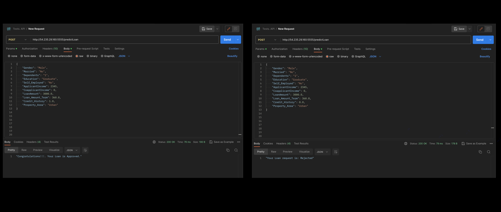

# **Predicting Loan Approval: Supervised Machine Learning and Deployment**
 
 
 

# Process: 
 

 
 
 

# Project/Goals
The goal of this project is to develop and deploy a supervised machine learning algorithm for predicting loan application outcomes. 
 
 
 

# Hypothesis
Applicants with good credit score and decent ammount of income are most likely to have their loan approved. This is because lenders use rely on these metrics to investigate borrowing habbits and the likelihood of timely payment. This is further tested by examining loan ammount to income ration (loan ammount / income), credit history and weather most applicants got approved or not.
 
 
 

# EDA 

# Model building
> The steps utilized involved feature selection, building a base model, hyperparameter tuning and boosting models. 
> The results are depicted below

# Results/Demo
http://54.235.29.160:5555/predictLoan

# Challanges 
Got caught up in getting a perfect model\
Wasn’t able to deploy on time\
AWS deployment learning curve is steepe\
Pickle…

## Future Goals
Refine the model to predict more accurately and adress the bias within marital statuses. 